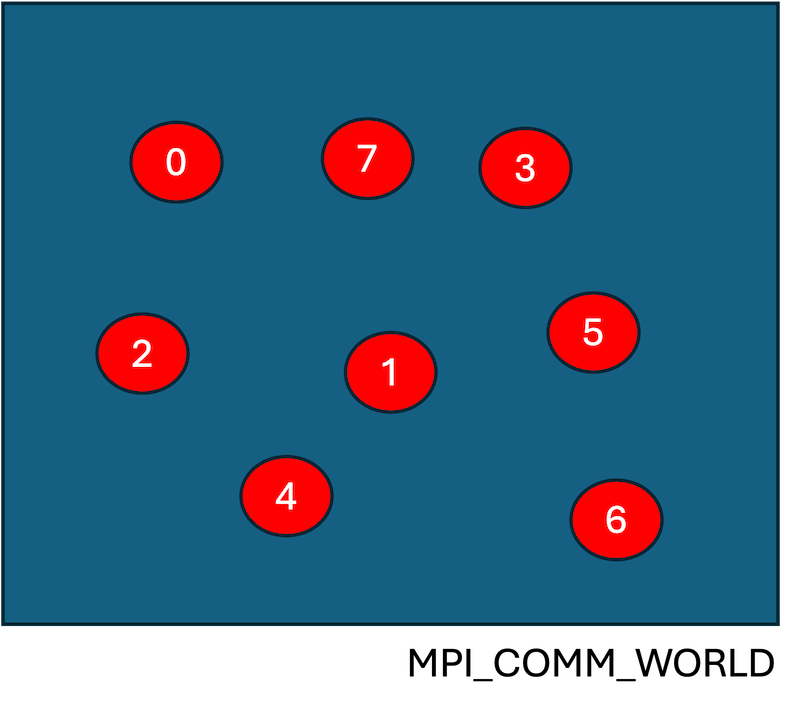
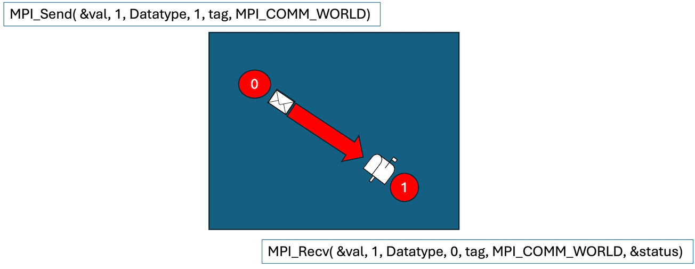
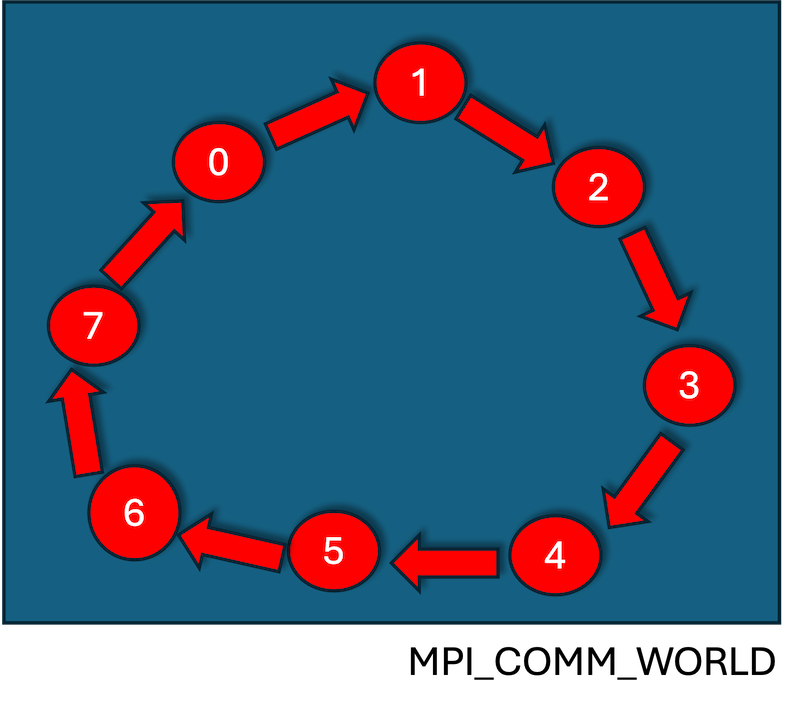

# MPI from Scratch

* [Learning objectives](#learning-objectives)
* [Prerequisites](#prerequisites)
* [Resources](#resources)
* [What is MPI?](#what-is-mpi)
* [C code](#c-code)
* [Finding rank and size](#finding-rank-and-size)
* [Ping pong](#ping-pong)

## Learning objectives Alec

This tutorial was constructed to allow a set of students to get an idea about MPI (Message Passing Interface) with little programming experience. It is not intended to teach C or MPI but walk you throught the processes. By the end of this tutorial you should:

* Have an idea of what an MPI program is.

## Prequisites Alice

You will need:

* An **editor**. An editor allows you to write plain text without any embedded text formatting.
* A **compiler**. This converts your source code, something you understand, into machine executable code, something your computer is able to run.
* An **MPI distribution**. This is the library that will allow you to get your code to be able to communicate.

## Resources

You may find the following useful:

* Another tutorial in [Using MPI with C](https://curc.readthedocs.io/en/latest/programming/MPI-C.html).
* The [MPI standard](https://www.mpi-forum.org/docs/).

## What is MPI?

In the early days of parallel computing every hardware vendor was coming up with similar communications libraries that were similar but different. If you were parallelising your code, which was no small undertaking, you would have to change your source code to change it from one machine to another to another. In 1994 the Message Passing Interface Forum came up with the first version, 1.0, of the *Message Passing Interface* (MPI) standard. Subsequently vendors started creating message passing libraries that adherred to this interface. This meant that if you used the MPI standard to parallelise your code then you should be able to port it to a new parallel machine with minor modifications. Now, MPI is universally available in nearly all High Performance Computing (HPC) platforms.

## C code 

Your first minimalist traditional C program is to get it to print out `Hello World!`. Write this program to a file called `hello.c`:

```C
/* This is a comment and will be ignored */
#include <stdio.h> /* This contains definitions to libraries */

/* All C programs must have a main program */
/* int means the value of the variable is an integer (a whole number) */
/* char means string and the * means it will be a pointer, point to an address */
/* argc contains the number of arguments passed to the program */
/* argv is an array containing the values of the arguments */
int main(int argc,char *argv[])
{
  printf("Hellow World!\n"); /* This will print hello world to the screen */
}
```

See [hello.c](src/hello.c).

Note:

* All C statements must be terminated by a semicolon.
* The `\n` tells what is printed to take a new line.

In order to execute this program we need to compile the code. This will have to be compiled using the shell:

```bash
gcc -o hello hello.c
```

Here we are using the `gcc` compiler. The `-o` flag tells the compiler what to call the output executable (the default is to call it `a.out` if you do not specify anything). To run the code just type the executable name:

```bash
./hello
```

## MPI hello world

In a similar fashion we can write an MPI `Hello World!` program. Things are a little more complicated as we now have to use a wrapper to our C compiler to hide complicated compiler invocations.

To start our code now looks like:

```c
#include <stdio.h>
#include <mpi.h> /* We now need to define MPI routines */

int main(int argc, char *argv[])
{
  /* All MPI Programs must call MPI_Init at the start */
  MPI_Init(&argc, &argv);
  
  printf("Hello World!\n");
   
  /* Once all the MPI bits are finished you call MPI_Finalize */
  MPI_Finalize();
}
```

See [mpi_hello.c](src/mpi_hello.c).

The `&` in front of a variable name means we are passing the address to that variable.

If you call this `mpi_hello.c` then this time we compile the code using:

```bash
mpicc -o mpi_hello mpi_hello.c
```

To run the code this time we use:

```bash
mpirun -n 1 ./mpi_hello
```

The `-n` is telling MPI how many process to run on. So now we can do:

```bash
mpirun -n 4 ./mpi_hello
Hello World!
Hello World!
Hello World!
Hello World!
```

## Finding rank and size

Every process that participates in an MPI program is given a unique number, referred to as the `rank`, within a given communications context, the default is `MPI_COMM_WORLD`, which starts from 0 to the total number of processes involved. In the diagram below we have 8 processes (we start counting from 0) defined in our communications world.



We can query this information and use it in our MPI program:

```C
#include <stdio.h>
#include <mpi.h> 

int main(int argc, char *argv[])
{
  /* Define variables that we are going to use in the program */
  int rank, size;
  
  MPI_Init(&argc, &argv);
  
  /* Find out how many processes are involved, pass it the address (use &) of size. */
  MPI_Comm_size(MPI_COMM_WORLD, &size);

  /* Find out what id this process has, again pass the adreess of the variable. */
  MPI_Comm_rank(MPI_COMM_WORLD, &rank);
  
  /* Print the rank and the size, %d means print an integer. */
  printf("Hello World! from rank %d out of %d processes\n", rank, size);
   
  /* Once all the MPI bits are finished you call MPI_Finalize */
  MPI_Finalize();
}
```

See [mpi_hello2.c](src/mpi_hello2.c).

Now compile as before:

```bash
mpicc -o mpi_hello2 mpi_hello2.c
```

and you can run it using:

```bash
mpirun -n 4 ./mpi_hello2
Hello World! from rank 0 out of 4 processes
Hello World! from rank 1 out of 4 processes
Hello World! from rank 2 out of 4 processes
Hello World! from rank 3 out of 4 processes
```

## Ping pong

We can now write programs that will exchange information. 



The messaging routines `MPI_Send` and `MPI_Recv` are blocking, that is they do not move on until they have completed their part of the message exchange (there are non-blocking variants), which means unless you post a receive for every send the program will dead-lock (just hang). For both variants you provide the address to the data that you wish to send, how many elements you will send (1 in this instance - these values must match at both ends), the type of data that you want to send/receive, for instance for an integer you would use `MPI_INT`, `MPI_FLOAT` for a floating point number, the destination you are going to send to - in this case we are sending to process 1 and process 1 is receiving from process 0. The `tag`s must also match - safer to make them the same, say 0. You can specify that you are going to receive from any process at the receive end by specifying `MPI_ANY_TAG` - if you wanted to send to all processes you would use `MPI_Broadcast`. You have to specify the communicator, `MPI_COMM_WORLD`, which specifies the communications context - a rank is unique within a given communicator. Finally, the receive call has a a pointer to a `status` which allows you to query information about the message you received. For instance, if you used `MPI_ANY_TAG` you could query from which process you actually received the message from. 

We will only use two processes for this exercise.

```c
#include <stdio.h>
#include <mpi.h> 

int main(int argc, char *argv[])
{
  int rank, size, mysend, myrecv;
  MPI_Status status;
  
  MPI_Init(&argc, &argv);
  
  /* Find out how many processes are involved. */
  MPI_Comm_size(MPI_COMM_WORLD, &size);

  /* Find out what id this process has. */
  MPI_Comm_rank(MPI_COMM_WORLD, &rank);
  
  /* Check we are only using two processes. */
  if(size > 2){
    if(rank == 0){ /* Only want one process to print error. */
      printf("This code will only work on two processes!\n\n");
    }
    /* Exit. */
    MPI_Abort(MPI_COMM_WORLD,1);
  }
  /* Initialise the values. */
  mysend = rank;
  myrecv = rank;
  
  /* Exchange messages. */
  if(rank == 0){
    MPI_Send(&mysend, 1, MPI_INT, 1, 1, MPI_COMM_WORLD);
    MPI_Recv(&myrecv, 1, MPI_INT, 1, 1, MPI_COMM_WORLD, &status);
  }else{
    MPI_Recv(&myrecv, 1, MPI_INT, 0, 1, MPI_COMM_WORLD, &status);
    MPI_Send(&mysend, 1, MPI_INT, 0, 1, MPI_COMM_WORLD);
  }
   
  /* Print out the result. */
  printf("Rank %d has mysend=%d and myrecv=%d.\n", rank, mysend, myrecv);
  
  MPI_Finalize();
}
```

See [pingpong.c](src/pingpong.c).

Compile using:

```c
mpicc -o pingpong pingpong.c
```

and to run:

```bash
mpirun -n 2 ./pingpong
Rank 1 has mysend=1 and myrecv=0.
Rank 0 has mysend=0 and myrecv=1.
```

## Message around a ring

Now lets put what we know up to this point to pass a message round a ring as in the diagram below starting from process 0.



```c
#include <stdio.h>
#include <mpi.h> 

int main(int argc, char *argv[])
{
  int rank, size, mysend, myrecv;
  int sendto, getfrom;
  MPI_Status status;
  
  MPI_Init(&argc, &argv);
  
  /* Find out how many processes are involved. */
  MPI_Comm_size(MPI_COMM_WORLD, &size);

  /* Find out what id this process has. */
  MPI_Comm_rank(MPI_COMM_WORLD, &rank);
  
  /* work out who we are going to send to and receive from. */
  sendto = rank + 1;
  getfrom = rank - 1;
  
  /* Deal with processors at the start and end of the ring. */
  if(rank == 0){getfrom = size - 1;}
  if(rank == size - 1) {sendto = 0;}
  
  /* Set the values to send and receive - add 1 at each send. */
  mysend = 0;
  myrecv = 0;
  
  /* Exchange messages. */
  if(rank == 0){
    mysend += 1;
    MPI_Send(&mysend, 1, MPI_INT, sendto, 1, MPI_COMM_WORLD);
    MPI_Recv(&myrecv, 1, MPI_INT, getfrom, 1, MPI_COMM_WORLD, &status);
  }else{
    MPI_Recv(&myrecv, 1, MPI_INT, getfrom, 1, MPI_COMM_WORLD, &status);
    mysend = myrecv + 1;
    MPI_Send(&mysend, 1, MPI_INT, sendto, 1, MPI_COMM_WORLD);
  }
   
  /* Procss 0 prints out the result. */
  if(rank == 0){
    printf("Rank %d has myrecv=%d.\n", rank, myrecv);
  } 
  
  MPI_Finalize();
}
```

See [ring.c](src/ring.c).

We can compile:

```bash
mpicc -o ring ring.c
```

and run:

```c
mpirun -n 8 ./ring
Rank 0 has myrecv=8.
```

which is the result we would expect with every process adding one to the result.

---

<a rel="license" href="http://creativecommons.org/licenses/by/4.0/"></a><br/>This work is licensed under a <a rel="license" href="http://creativecommons.org/licenses/by/4.0/">Creative Commons Attribution 4.0 International License</a>.